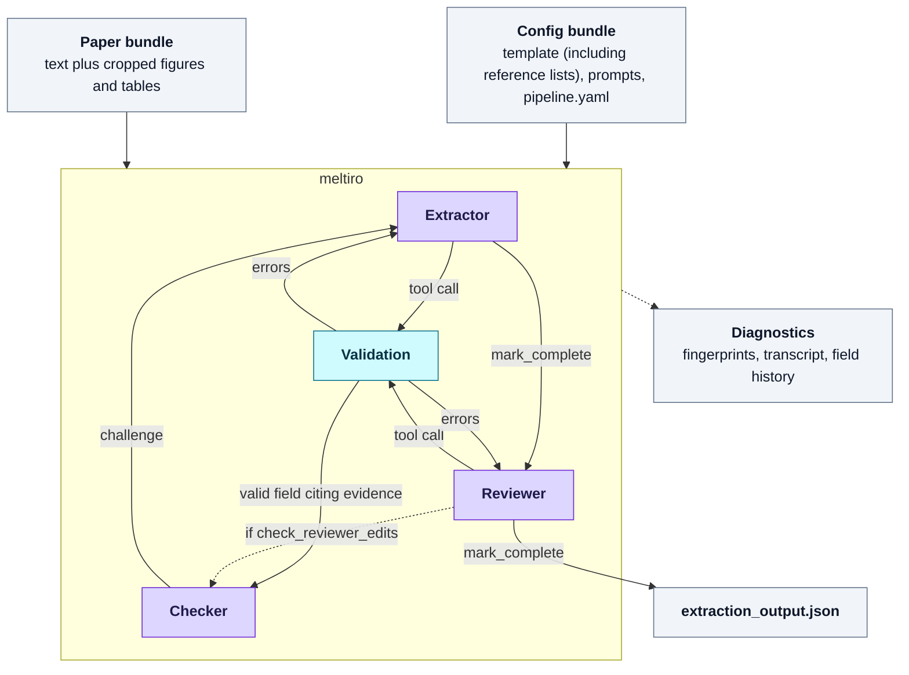

# meltiro

[](https://github.com/edpenington/meltiro/actions/workflows/ci.yml)

*meltiro* is a pipeline for LLM-assisted data extraction and quality assessment
in systematic reviews and other evidence synthesis. It runs per study, through
a CLI. It is built to make the extraction process transparent and reproducible
— every run is deterministically fingerprinted — and to limit hallucination by
linking extracted values to a figure, table or verbatim quote from the study,
wherever that is feasible.

LLM-assisted extraction is a powerful tool but continues to have severe
limitations. Using *meltiro* well means careful design, calibration and
refinement of the extraction template and prompts, and human confirmation of
every extracted field.

## What it does, and what it does not

**It takes** a *config bundle* (extraction template, prompts, reference lists,
pipeline settings) and a *paper bundle* (clean full text, cropped tables and
figures, a manifest), and **returns** a validated extraction in which every
field carries its evidence (if applicable), plus a deterministic record of how
the run went. The extraction output can contain both study-level fields (e.g.
authors, aim, conclusion) and a specified record type which may be extracted more
than once per study (e.g. prevalence estimates, treatment effects), each with
its own set of fields (subgroups, controls, etc.). Currently only one record
type is permitted per run.

**It does not** fetch or convert papers, crop figures, judge whether a crop is
good, or replace human verification. It does not guarantee that the same
fingerprint yields the same output: a fingerprint pins a run's *inputs*, never
its outputs.

## How it works

**Validation is deterministic** and is applied at each stage. Every
value an LLM proposes is checked against the extraction template by
code: right type, within any declared reference list, evidence present and
actually found in the source text where the template requires it. Validation is
per field, so the fields that pass are written and only the failures come back
— with an informative message — to the model that wrote them.

The template determines which fields require evidence. A field marked 
`evidence: required` holding a non-null value is rejected — and handed 
back to the model with the reason — unless it carries at least one `<q>` 
quotation located verbatim in `text.md`, or an `` reference to a cropped 
exhibit the paper bundle supplies. Three cases sit outside that guarantee:

- `evidence: optional` fields, for judgements the paper does not state, accept
  a non-null value with no evidence at all. How many a review has is a property
  of the template its author writes.
- A null value never demands evidence, whatever the field is marked; an
  evidence string on one is a free-text explanation of the absence.
- An `` reference is checked only for its label resolving to a crop the
  bundle declared and supplied. **Nothing reads the image.** A crop that clips
  its header row, or catches the wrong table, satisfies `evidence: required`
  for any value whatever. Whether the exhibit supports the extracted value
  is only judged by the checker LLM.

The two self-assessment blocks, `initial_check` and `quality_check`, are the
roles' reports on how the run went rather than claims about the paper, so they
sit outside the evidence contract entirely and carry none.

There are three agent roles. They are deliberately uncorrelated: each has its
own prompt and its own context, and they may be assigned different models
(`pipeline.yaml` sets one per role).

1. **Extractor** (once per paper) — an agentic loop with the paper bundle in
   context and ten tools. It must open with `record_initial_check`, its report
   on the material it was handed. It then fills a validated extraction output
   with `update_study`, `add_record`, `update_record` and `remove_record`. It
   can read back what it has already written with the `view_*` tools. It has
   two exits: `mark_complete`, declaring the run finished and reporting on how
   it went; and `abandon_extraction`, for when it judges that no honest
   extraction can be produced from the provided inputs

2. **Checker** (per field submission) — a narrow call with deliberately
   restricted context, re-asked at most once as a correction if it records no
   verdict, run inside the tool call rather than as a stage of its own. Any
   field that carries evidence is eligible, whether or not the template
   requires evidence for it. The Checker sees the field definition, a short
   identity context for the paper (and the record, if it's a record-level
   field), the extracted value, and the recorded evidence with its surrounding
   text — and is asked only whether the evidence supports the value. A
   challenge is advisory and returns in the same tool result as any validation
   errors, so the Extractor can revise or overrule it from its broader
   context. Each field can be checked at most `max_checks_per_field` times
   (default 2).

3. **Reviewer** (once per paper) — a second agentic loop with a fresh context,
   the completed extraction, and its own prompt. Its catalogue is the
   Extractor's minus `record_initial_check`. Its edits pass through the same
   validation, and are themselves checked only when `check_reviewer_edits:
   true`. It records its own quality check as a required argument of its
   `mark_complete`, stored under its own role key beside the Extractor's.

The Checker and Reviewer are each optional per run (`max_checks_per_field: 0`,
`final_review: false`). The structure chosen is recorded in the run record and
folds into the fingerprints.



Purple is an LLM call; blue is deterministic code. The orchestration loop
around them is fixed code: runs are fingerprinted, resumable, and comparable
across configurations.

## Installation

Python 3.11 or newer, on a POSIX system (Linux or macOS). The run log is
appended under an exclusive `flock`, so that two sessions finishing at once
cannot clobber each other's entry, and `fcntl` is POSIX-only. Windows is not
supported and is not tested at this stage.

*meltiro* depends on [direktoro](https://github.com/edpenington/direktoro), the
shared provider layer that owns the model registry and the adapters. It is not
on PyPI yet, so install it first:

```bash
git clone https://github.com/edpenington/meltiro
cd meltiro
python3 -m venv .venv
.venv/bin/pip install "direktoro @ git+https://github.com/edpenington/direktoro"
.venv/bin/pip install -e ".[dev]"
```

Verify with the test suite, which needs no API key and makes no network call (a
guard in `tests/conftest.py` enforces that rather than leaving it to chance):

```bash
.venv/bin/python -m pytest tests/ -q
```

**Quick start.** Render the whole instrument against the synthetic fixtures
without spending anything:

```bash
.venv/bin/meltiro extract \
  --config tests/fixtures/config_synthetic \
  --paper tests/fixtures/bundle_minimal \
  --dry-run
```

A dry run makes no API call, needs no key, and creates no session. It loads and
validates both bundles and prints the rendered prompts, the tool catalogue, the
figure labels and the fingerprints. Add `--out DIR` to write them to
`{out}/{study}/dry_run/` as well. The same command without `--dry-run` calls
the providers and needs their keys.

## Usage

```bash
meltiro extract --config CONFIG_DIR --paper BUNDLE_DIR [--paper ...] [--out DIR]
meltiro transcript SESSION_DIR --out FILE
meltiro validate-bundle BUNDLE_DIR [BUNDLE_DIR ...]
meltiro validate --config CONFIG_DIR EXTRACTION_OUTPUT [--paper BUNDLE_DIR]
meltiro fingerprint --config CONFIG_DIR
meltiro render-template --config CONFIG_DIR --view {operational,publication} --out FILE
meltiro --version
```

`--version` takes no subcommand. It prints the release and the `engine_fp` this
installation would record, with the checkout it sits in and the direktoro
version beside it — so an operator holding a `run.json` can check the engine
axis of a run against the code in front of them without opening Python.

`extract` also takes `--dry-run`, per-role model overrides
(`--extractor-model`, `--checker-model`, `--review-model`), cap overrides
(`--max-tool-calls`, `--max-checks-per-field`), `--final-review` /
`--no-final-review`, and `--diagnostics {minimal,standard,full}`.

**Resuming.** A run that hits its tool-call cap pauses rather than failing, and
can be continued: `--resume SESSION_DIR` continues a named session, and
`--auto-resume` finds the newest in-progress session whose config still
matches. A resume is refused if the config has drifted, because continuing
under a changed instrument would produce a run no fingerprint describes. The
tool-call cap itself is deliberately in no fingerprint, so raising the cap and
resuming is accepted rather than refused as drift.

`transcript` re-renders a session as one Markdown document. Every run already
writes that document itself whenever it stops; this reads an already-paid run
through a newer renderer, and changes nothing in the session.

`validate` re-checks the stored values in an `extraction_output.json` against
the config, so there is nothing to run it against until an extraction has
completed. Pass `--paper` to quote-check the evidence too.

**Exit codes.** `0` — the run produced a session and an output, including a run
that paused on its cap (`in_progress`) or finished `failed_validation`. `1` —
status `error`, an invalid bundle, or any failure of the read-only subcommands.
`2` — a usage error, or a resume refused for config drift.

**Providers and keys.** Transport follows `direktoro`: its registry decides,
per model, which endpoint the call goes to, whether it is called direct or
routed through a gateway, and which environment variable holds the key — all
pinned and fingerprinted. A run needs only the keys its enabled roles' models
use, and a missing one is named, with the stage that wanted it, before any
spend.

**Environment.** Beyond those keys, `CHECKER_CONCURRENCY` is the only variable
*meltiro* reads, and it is a fallback for `checker_concurrency` that
`pipeline.yaml` overrides wherever it sets the key. It must be a positive
integer — `0` is refused at startup, and is not how the checker is disabled
(`max_checks_per_field: 0` is). Being operational rather than methodological it
reaches no fingerprint. **Nothing else about a run is settable from the
environment**: every model, decoding parameter and cap comes from the config
bundle or an explicit flag, which is what makes a tagged tree fingerprint
identically under any shell.

## The paper bundle

*meltiro* consumes a directory per paper. Any tool that produces this layout
can feed it.

```
paper-bundle/
├── manifest.json      # required
├── text.md            # required: the paper's full text as markdown
└── figures/           # optional: one PNG per declared exhibit
    ├── table_01.png
    └── figure_02.png
```

```json
{
  "schema_version": 1,
  "id": "1702",
  "title": "Durability gauge scores and service life in load-bearing widgets",
  "doi": "10.5555/widget.2027.0142",
  "exhibits": [
    {"label": "table_01", "caption": "Table 1. Sample characteristics"},
    {"label": "figure_02", "caption": "Figure 2. Study flow"}
  ],
  "summary": "..."
}
```

- `schema_version` (must be `1`), `id`, `title` and `exhibits` are required.
  `id` is an opaque identifier you choose — letters, digits, `.`, `_`, `-`,
  with at least one alphanumeric so `.` and `..` are rejected — and it names
  the output directory.
- `exhibits` declares every table and figure supplied as a cropped image:
  exactly a `label` (the `figures/<label>.png` stem) and the caption the paper
  prints. It may be `[]` for a paper that genuinely has neither. It is required
  so an author either enumerates the exhibits or says explicitly that there are
  none; a bundle quietly shipping no crops for a paper full of tables is the
  failure this key exists to prevent.
- Two cross-checks bind declaration to directory, both hard errors: every
  declared label must have its PNG, and every PNG must be declared. **No check
  can see crop quality.** A crop that clips its header row, or catches the
  wrong table, passes everything here. Looking at the crops stays a human job.
  Nor can any check know the paper contains a table nobody cropped — that
  question goes to the Extractor, which reads the paper.
- `summary` is optional and overrides what the Checker is shown as the paper's
  short identity. Without it the Checker uses the extracted field the template
  marks `role: summary`. If neither is available at check time the Checker
  degrades to title plus DOI and records a warning.
- Unknown manifest keys are rejected. Extra *files* in the bundle directory are
  ignored, so a bundle may carry its own paperwork alongside the contract
  files; inside `figures/`, a non-PNG or a subdirectory is an error.

Evidence is checked verbatim against `text.md`, markdown syntax included, so a
converter should keep inline emphasis out of running text where it can. A
sentence reporting an italicised statistic as `*N* = 42` makes `*N* = 42`, not
`N = 42`, the string the Extractor must quote.

## The config bundle

Everything specific to a review lives in one directory:

```
config-bundle/
├── pipeline.yaml             # models per role, decoding params, caps, structure
├── extraction_template.yaml  # field definitions, the record entity, gates
├── reference/                # named lists the template and prompts can cite
│   └── gauge_list.yaml
└── prompts/
    ├── extractor_system.md
    ├── review_system.md
    ├── checker_system.md
    ├── checker_user_template.md
    └── partials/             # optional shared blocks
        └── meltiro/          # optional overrides of engine sections
```

Prompts may cite a shared block with `{include:NAME}`, or one that follows a
stage with `{include_if:checker:NAME}` / `{include_if:review:NAME}` — the block
is rendered only when that stage is enabled for the run, so a prompt never
briefs a model on a stage that will not run. A cited partial must exist whether
or not its branch is taken. Prompts may also cite a reference list with
`{reference:NAME}`.

### The engine's own sections

How the engine behaves is not a methodological choice, so a review does not
have to describe it. *meltiro* ships that description as prose, one named file
per section, and a prompt composes it with `{include:meltiro:NAME}`:

| Section | Role | What it states |
|---|---|---|
| `extractor_workflow` | Extractor | the initial-check-first gate, the `ok` / `partial` / `validation_failed` result shape and `failed_fields`, challenges arriving in tool results, the per-field check budget, `mark_complete`, `abandon_extraction`, the finite call budget, the view tools |
| `recording_evidence` | Extractor | the `<q>` / `` evidence grammar: normalisation, elision, insertion brackets, and the image-label list |
| `recording_notes` | Extractor | field notes versus scope notes, and who is shown which |
| `recording_conventions` | Extractor | record-id assignment, strict versus open lists, reference-list fields, warnings versus errors |
| `checker_briefing` | Checker | the checker's one-field isolation, the quote window and its table expansion, the allowed-values briefing, no memory across checks |

The Review prompt composes no engine section, and none is written for it: the
reviewer edits the assembled record under the same tool schemas the Extractor
wrote it with, so what it needs to know arrives in those schemas and in your
bundle's own prose about the review.

These compose with predicates like any other block
(`{include_if:checker:meltiro:checker_briefing}`), and a name outside the list
above is a load error naming the ones that exist. Your prompt supplies
everything around them: the role framing, the review's scope and criteria, what
counts as one record, what each field means.

A section fills the slots its own role's prompt supplies, so composing one into
a prompt that supplies fewer is a load error naming the variable left over. The
Checker's system prompt supplies one slot, `{max_checks_per_field}`; the
Extractor's and Reviewer's also supply `{image_labels_list}`. Composing
`recording_evidence`, which renders that list, into the Checker's prompt is
refused by name rather than sent as a literal token.

A review may **override** any section by shipping
`prompts/partials/meltiro/NAME.md`; that text then wins wherever the section is
cited, and the engine's copy is not consulted. The filename is the whole of the
wiring, so that directory is enumerated at load: a file named for no section
(`recording_note.md`, `Recording_Notes.md`, `house_style.md`) is a load error
rather than a file that quietly overrides nothing. Overriding moves the config
fingerprints (`prompts_hash`, `instrument_fp`, and the stage fingerprint of
whichever prompt cites it), because the text is now yours: an un-overridden
section rides in `engine_fp` instead, so an engine release that rewords one
leaves every bundle's config fingerprints exactly where they were. Two bundles
composing the same section, one on the default and one overriding it with
byte-identical text, read identically to a model and fingerprint differently —
one is pinned to the engine's wording, the other to its own.

A role's system prompt that composes no section of its own role loads with a
warning on stderr: the engine's behaviour is then described to that model only
by whatever the prompt says itself, and a prompt that describes it wrongly is
obeyed, not corrected. A stage that is off is passed over — with
`max_checks_per_field: 0` there is no Checker call to underbrief.

`pipeline.yaml` takes exactly these keys; anything else is a load error.

| Key | Default | |
|---|---|---|
| `extractor_model` | *required* | |
| `checker_model` | required if the checker is on | |
| `review_model` | required if the reviewer is on | |
| `max_checks_per_field` | `2` | `0` disables the Checker |
| `final_review` | `true` | |
| `check_reviewer_edits` | `false` | check the Reviewer's own edits |
| `max_tool_calls` | `100` | per study; pauses, does not fail |
| `max_review_tool_calls` | `30` | |
| `{extractor,review,checker}_decoding` | unset | that role's decoding parameters (below); nothing is inherited between roles |
| `extractor_max_tokens` | *required* | |
| `review_max_tokens` | required if the reviewer is on | |
| `checker_max_tokens` | required if the checker is on | |
| `checker_concurrency` | `10` | |
| `checker_context_chars` | `1000` | paper text either side of a quote |
| `rates` | unset | a USD rate card per role; unnamed roles take the price table's |

A `<role>_decoding` block is a mapping of decoding parameter names to values,
and meltiro reads no name inside it. The block goes whole to direktoro's
`split_decoding_config`, which is the authority on which names are legal and
which of them is what: the sampling controls `temperature`, `top_p` and
`top_k`, and the thinking fields `thinking_mode`, `thinking_effort`,
`thinking_budget_tokens` and `thinking_display`. A parameter that layer gains
is usable from `pipeline.yaml` with no edit here, and a name it does not know
is reported as an error rather than dropped. A key set to null reads as
unspecified, exactly like an absent one, so a bundle may carry a fixed key set
and leave values empty.

```yaml
extractor_decoding:
  thinking_mode: adaptive
  thinking_effort: high
checker_decoding:
  temperature: 0.0
```

A role with no block specifies nothing: each model's own defaults apply, and
the run records that the role pinned none of them.

The whole bundle is validated before anything reaches a provider, in two layers
a library consumer needs to tell apart:

- `load_config_bundle` checks what the bundle settles on its own — a missing
  required file, an unknown key, an unresolvable `{include:…}` or
  `{reference:…}`, a banned placeholder — and raises `ConfigBundleError`.
- The **CLI** checks what only the model registry and the numeric domains can
  settle, as `extract` starts and still before any spend: an unknown or retired
  model, a missing output-token cap for a role that will call, a cap or checker
  concurrency that is not a positive integer, a malformed `rates:` block, and
  each enabled role's whole call resolved against the registry — an unknown key
  in its decoding block, a value outside the band that model's registry entry
  documents for a control it accepts, a thinking mode, effort level or display
  its entry does not declare, and a cap too small for a call that will reason to
  answer within. Each exits non-zero with the offending key named. The
  call-level half of that is not the CLI's alone: `Orchestrator.__init__` makes
  the same resolution, so a run started from Python is refused on the same
  terms, and the CLI's gate is what turns the refusal into one line and an
  exit code.

One thing is reported rather than refused: a sampling control a model declares
it refuses OUTRIGHT is never sent, whatever value the block gives it, so there
is no request that could fail. The run starts, and says on stderr and in
`meta.warnings` that the configured value reaches nothing and moves no
fingerprint — which is the only fact about it that is true, and one no
fingerprint comparison would otherwise reveal.

The split matters because the second layer is not reachable from the library
surface below. A bundle naming a model that does not exist **loads clean**, and
`meltiro fingerprint` prints an `instrument_fp` for it — the instrument is
model-free, so it is a real answer to a different question. Only `meltiro
extract` refuses the bundle. A consumer that validates bundles itself should
run them through the CLI, not through `load_config_bundle` alone.

### Pricing a run

Each role runs its own model, so each role prices its own calls. `rates:` maps a
role to its card:

```yaml
rates:                      # optional, per role; USD per MILLION tokens
  extractor:
    input_per_1m: 5.0
    output_per_1m: 25.0
    cache_read_per_1m: 0.5
    cache_write_per_1m: 6.25
  checker:
    input_per_1m: 1.0
    output_per_1m: 5.0
    cache_read_per_1m: 0.1
    cache_write_per_1m: 1.25
```

All four rates are required together within a card, and `0.0` is a legitimate
rate (a provider with no prompt-cache tier). A role you leave out — `review`,
above — takes its rates from *direktoro*'s dated price table, which records each
vendor's published rate together with the day the vendor's page was read.

Every figure is recorded beside the card that produced it and that card's
provenance: `source` (`operator` or `table`), `as_of` (the reading date, for a
table card) and `table_version` (which table data supplied it). `run.json` and
each `run_log.json` entry carry `cost_usd` and `usage_by_role`, so a reader
multiplies a role's counters by that role's rates and gets the role's figure
back, whatever anything costs by the time they read it. Startup prints one line
per role naming what will price it, before the first call.

**A role with neither a card nor a table entry runs unpriced.** It records its
four token counters — which come from the provider and cannot go stale — and its
`cost_usd` is `null`, and the run's total is `null` with it, because a sum over
the priced roles would read as the whole run. Never `0.0`: an unpriced role was
not a free one, and the CLI and transcript say *not priced* rather than showing
a dollar sign.

A gateway-routed model is priced from the charge the gateway reports on each
response: a fact about what was billed rather than a prediction, so that role
needs no card and is never looked up in the table. A response that carries no
charge is a loud failure for the extractor and the reviewer, whose call stands
alone. For a checker call it is recorded instead — one field's check runs in a
fan-out beside paid siblings, and its verdict is what the run is buying — so
the figure covers the receipts there were and says how many calls it does not,
`run.json` carries `cost_incomplete` and `unreceipted_calls`, and the CLI and
transcript state the total as *at least* that much.

Rates are commercial, not methodological. Two runs differing only in the prices
you typed asked the same models the same questions of the same paper, so a rate
card reaches no fingerprint and such runs compare directly.

## Outputs

```
{--out}/
├── run_log.json                          # one entry per finished session
└── {study id}/sessions/{YYYYmmdd}_{HHMMSS}_{microseconds}_{6 hex}/
    ├── extraction_output.json
    └── diagnostics/
        ├── run.json                      # the run record: fingerprints, counts, spend
        ├── field_history.json
        ├── transcript.md                 # the whole session as one document
        ├── tool_calls.jsonl
        ├── api_calls.jsonl               # --diagnostics full only
        └── instrument/                   # the rendered prompts and tool definitions
```

The session directory name is a UTC start time to the microsecond — the
microseconds are what keep two sessions started in the same second apart —
followed by the first six hex characters of `config_fp`. It is a readable
handle, not an identifier to parse: the full fingerprints are in `run.json`,
which is where a consumer should read them.

`extraction_output.json` carries four keys: `initial_check` and
`quality_check`, each keyed by the role that wrote it; `study`, mapping each
variable to `{value, evidence, notes}`; and `records`, a list of the repeated
entity, each with an engine-assigned `record_id` that is never renumbered and
never reissued.

**One key in `study` and in each record is not a field.** Alongside the
variable envelopes, both carry a reserved bare `notes` key holding a plain
string or `null` — the extractor's commentary on that whole scope, not on any
one variable. A parser that assumes every key of `study` maps to a `{value,
evidence, notes}` envelope hits a string here. It is deliberately outside the
field schema: no template may declare a variable named `notes`, it is never
validated, and the checker never sees it.

`--diagnostics {minimal,standard,full}` chooses how much of the record is kept.
The levels are strict supersets: `minimal` keeps the extraction output,
`run.json`, `field_history.json`, `transcript.md` and `tool_calls.jsonl`;
`standard` adds `instrument/`; `full` adds `api_calls.jsonl`. The invariant is
that nothing a level omits can be needed to resume a session or to regenerate a
derived artefact — with one exception, which is the real cost of `minimal`.
Because `minimal` never captures the instrument, a `minimal` session cannot
re-render the prompts and tool definitions its models actually saw: they were
never written down, and reconstructing them later would be valid only if the
config bundle had not changed since, which nothing in the session records. A
`minimal` session still resumes, and `meltiro transcript` still re-renders its
conversation; only the instrument is gone for good.

**Run statuses.** `complete` — trust it (after your own checking).
`in_progress` — it paused; resume it. `failed_validation` — it finished without
a valid extraction; investigate. `error` — it broke; fix and re-run. When the
reviewer is enabled, a run finalises `complete` only on the reviewer's
confirmation; the outcome mappings are exhaustive and default to failure, so
nothing unrecognised can finalise as success.

## Reproducibility and fingerprinting

Every run records fingerprints over its *inputs*. Three stage fingerprints
answer "did this stage's inputs change?": `config_fp` (the extractor),
`checker_fp`, `review_fp`. Each folds in that stage's call identity — model,
provider, endpoint, route, and the decoding parameters actually sent — with the
rendered prompt, the template, the tool definitions, the reference lists'
content, and the pipeline's structure toggles. `run_fp` folds the three
together with `engine_fp` into the identity of the whole run-producing
configuration. The checker and the reviewer are optional, and a stage that is
switched off contributes the fixed token `none` in its own fixed position in
`run_fp`'s preimage. So the four on/off combinations of the two produce four
distinct `run_fp` shapes, and a run with a stage disabled can never collide
with one where that stage ran.

Three further fingerprints separate what the stage fingerprints blend, so the
common comparisons are single-axis:

- `instrument_fp` — everything the config author wrote, model-free and
  engine-free. Same instrument on a different model: `instrument_fp` matches
  and a call fingerprint moves.
- `extractor_call_fp` / `checker_call_fp` / `review_call_fp` — one per role:
  which model, and how it is reached.
- `engine_fp` — the engine is two packages, and this names each of them twice:
  by the version it declares, and by a SHA-256 over its own source files
  (*meltiro*'s and direktoro's). Two runs share an `engine_fp` exactly when the
  same source ran, whether from a checkout, a wheel, or a tree with a working
  edit in it. The git commit and the tree's state are recorded beside it: they
  say where the copy came from, the fingerprint says what it was.

The suite pins every fingerprint to a literal, so a change to any preimage
fails loudly and has to be a deliberate, reviewed decision rather than a
silent drift. Two of them can be pinned only in composition: `engine_fp`
hashes the source itself, and `run_fp` folds `engine_fp` in, so an edit to
either package moves them both. What the literals fix for those two is how the
preimage is assembled from fixed inputs, not the value a live run records.

`meltiro fingerprint --config DIR` prints a bundle's content identity without
running anything.

The paper is excluded from every fingerprint above: the same config on a
different paper fingerprints identically, which is what makes those a statement
about the question rather than the answer. The paper carries an identity of its
own instead, recorded with the run and folded into nothing:

- `text_fp` — `text.md`'s bytes, the whole text the models were shown.
- `figures_fp` — the cropped figures, as sorted (label, content-hash) pairs.
  A paper supplying no crops hashes a fixed token, so "no figures" is a
  recorded fact rather than an absent one.
- `manifest_fp` — the manifest's content: id, title, doi, summary and the
  exhibit declarations, canonicalised, so a reformat moves nothing.
- `bundle_fp` — the three above, folded into one.

Each part moves only for its own input. Edit a line of `text.md` and `text_fp`
and `bundle_fp` move. Swap a crop for a better one and `figures_fp` and
`bundle_fp` move. Change the manifest's summary and `manifest_fp` and
`bundle_fp` move. So `run_fp` says what was asked and `bundle_fp` says what it
was asked of, and either can be compared while the other varies.

*meltiro*'s own prose — the framing the engine writes around your prompts, the
engine sections your prompts compose, and every tool result and validation
error it returns to a model — is covered by `engine_fp` and by nothing else. No
config fingerprint takes it as a preimage, deliberately, so a consumer can pin
those across releases; and it lives in the package's own files, the modules and
`engine_prompts/*.md`, which is exactly what `engine_fp` hashes. An edit to any
of that wording therefore moves `engine_fp` and every `run_fp` built on it,
whether or not it was ever committed. An engine section you have overridden is
your text, not the engine's, and rides in the config fingerprints instead. Runs
from different *meltiro* versions are still compared deliberately, never
assumed equivalent.

## Known limitations

These are properties of the design, not defects awaiting a fix. Anyone relying
on this work should read them.

**It is not always possible to fingerprint inputs.** A fingerprint includes the
parameters actually sent, but some models may reject certain parameters
outright (eg. sampling, temperature). If providers change their
internal regime, the model will behave differently despite no change in
fingerprinting. Truly consistent extraction with LLMs requires control over
the model being run.

**Reasoning prose is not evidence-checked.** Extracted values carry evidence
that is machine-checked verbatim against the paper. Free-text reasoning, such as
quality-assessment rationales, is not. It is prose the model
wrote, and nothing verifies its claims. While these findings can be repeatedly
checked by different models with different context, there are limits to what
can be formally linked to the text.

**A false challenge can destroy a correct value.** The Checker's narrow context
is what makes it uncorrelated with the Extractor, and it is also what lets it
be confidently wrong about a value the whole paper would settle. A challenge
currently reads as authoritative, and an Extractor that over-complies can
overwrite a correctly transcribed value. Careful management of the Extractor
prompt is required to ensure it exercises its best judgement.

## Use as a library

The pipeline is a CLI; the validation and loading surface is importable, and is
what a downstream consumer should build against:

```python
from meltiro import (
    load_config_bundle, load_bundle, validate_value,
    validate_extraction_output, RUN_STATUSES,
)
```

`import meltiro` succeeds without `direktoro` installed: every name in
`meltiro.__all__` is reachable with the provider layer absent. The model
registry is direktoro's own surface and is imported from there; the CLI does
require it.

**What `--no-deps` buys, exactly.** It is a way to install this wheel *without
the provider layer* — direktoro and the provider SDKs it brings — not a claim
that the package has no dependencies. Two are still needed and pip will not
fetch them for you:

```bash
pip install --no-deps "meltiro @ git+https://github.com/edpenington/meltiro"
pip install pyyaml          # needed by `import meltiro` itself
pip install python-dotenv   # needed by the CLI only; omit for library use
```

Without `pyyaml` the import itself fails (`meltiro.reference_lists` imports
`yaml`). With it, and with the whole provider layer and `python-dotenv`
absent, every name in `__all__` resolves and nothing pulls direktoro into
`sys.modules`. A `no-direktoro-import` job in CI installs exactly this way and
asserts precisely that.

Note the boundary around the bundle loaders. `load_config_bundle` validates
everything a bundle settles on its own, but the model-registry and numeric
checks live in the CLI (see [The config bundle](#the-config-bundle)) — and with
direktoro absent they cannot run at all. A bundle naming a nonexistent model
loads clean here.

## Licence and citation

Apache-2.0 (see `LICENSE`). If you use *meltiro* in academic work, cite it via
`CITATION.cff`.

The repository redistributes no third-party material: every fixture under
`tests/fixtures/` is invented for this suite, including the paper text.

Publishing a *meltiro* transcript publishes the quoted passages of the paper it
read. Transcripts of openly licensed papers can be shared as the licence
allows; for anything else, check before you publish.
